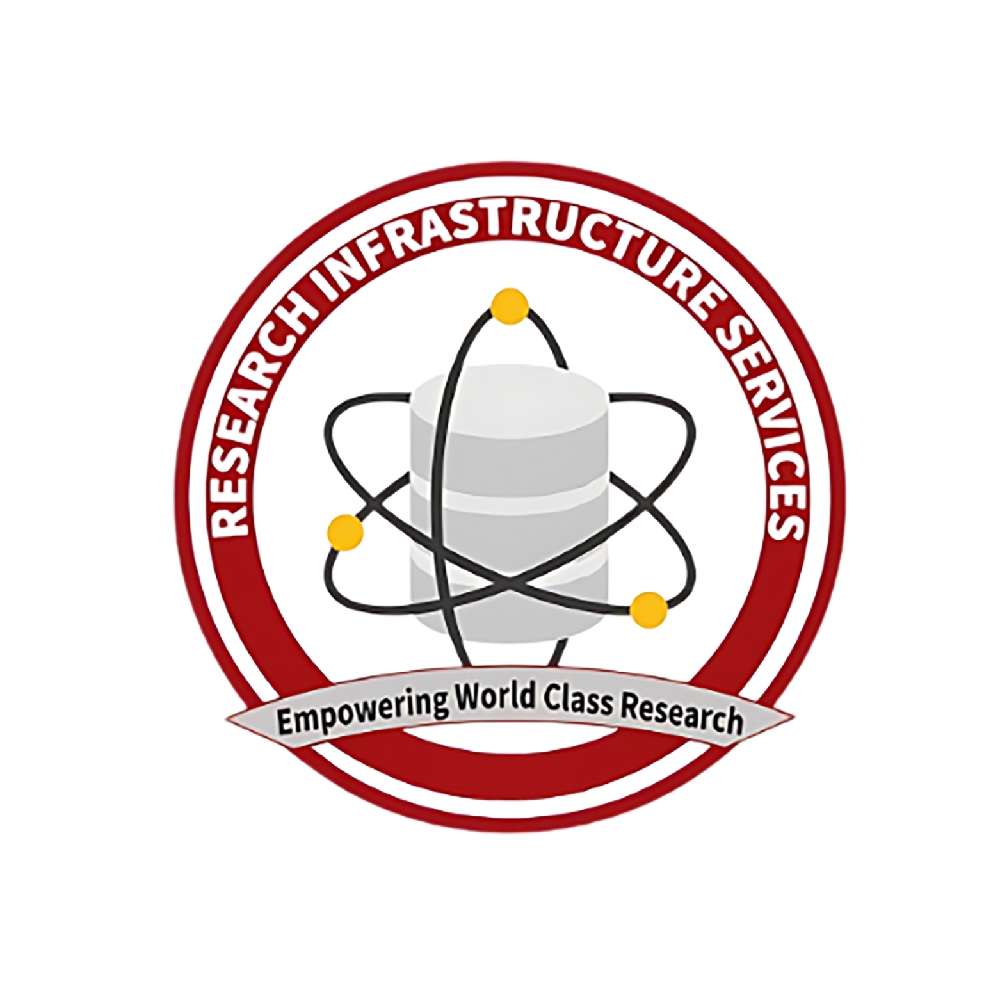

# Introductory-Compute

This is the repository for the RIS seminar series, Introductory Compute. If you are a beginner when it comes to HPC systems, this is the place for you.

## Getting Started with Open OnDemand

Open On Demand (OOD) is a web-based interface for connecting to and working in hpc environments. With the RIS OOD web interface, users can use point and click options to connect to and interact with RIS compute resources. Workshop attendees will learn how to use the OOD web interface to connect to RIS's Scientific Compute platform, and access a variety of software for running jobs on the system.

## Getting Started with the Command Line

This workshop will introduce the Unix command line interface, the Unix file system, and basic Unix commands. Attendees will learn to create, explore, and manage Unix files and folders.

## Getting Started with High Performance Computing

This workshop will introduce high performance computing and a variety of software applications used in hpc environments including text editors, shell and batch scripts, Docker container technology, and the ssh protocol. Attendees will learn how to write, edit, and run shell scripts, how to create a simple Docker container, and how to connect to the RIS Scientific Compute platform.

## Getting Started with the RIS Scientific Compute Platform

This workshop will introduce the queue system and basic queue system commands to submit and execute jobs on the RIS Scientific Compute Platform. Attendees will learn how to use Docker images and queue system commands to submit and process jobs.

## Fall 2024 Schedule
|Date|Time|Topic|
|----|-----|---------|
|09/04/2024 | 1pm - 2:30pm | Getting Started with Open OnDemand |
|09/11/2024 | 1pm - 2:30pm | Getting Started with the Command Line |
|09/18/2024 | 1pm - 2:30pm | Getting Started with High Performance Computing |
|09/25/2024 | 1pm - 2:30pm | Getting Started with the RIS Scientific Compute Platform |
